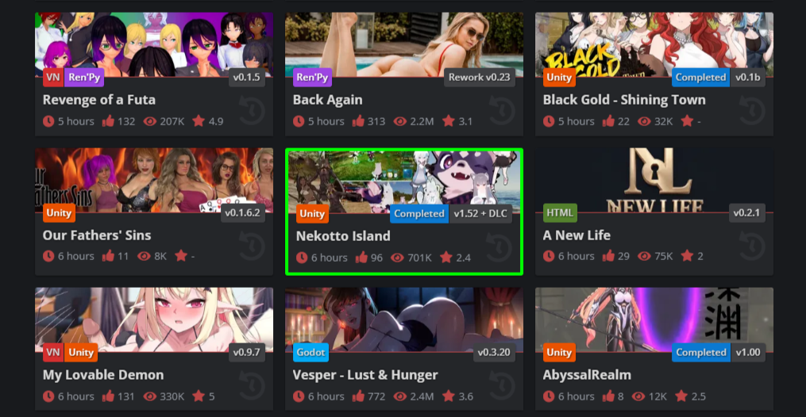

# F95 Highlighter

This project is a chrome/opera extension that tracks media downloaded from
f95zone.to and highlights their displays on the site. For example:

Here, the game "Nekotto Island" is flagged as downloaded with a high certainty (which is discussed later), so it has a bright green border. The purpose of which is to make it easier to tell what you have and haven't downloaded from the site without needing to check your files each time.

## Getting Downloads

There are 2 ways to tell the extension what you've downloaded: importing and adding them manually.

### Importing

When you import, all you're doing is giving the extension the name(s) of folder and/or files you've downloaded (assumedly from f95zone) and it'll try and match that name to f95 media. Other than their name, nothing is actually read or "imported" into the extension. What it does is convert each name to a search query, send it to f95zone, then check which results match the query the best. For some example searches:

Furries_Annonymous_Collection_2026-02 -> <https://f95zone.to/search/1/?q=furries+annonymous&c[title_only]=1&o=relevance>

MyLifeAsGoon-v1.0.12-f95cracked -> <https://f95zone.to/search/1/?q=my+life+as+goon&c[title_only]=1&o=relevance>

Doing this will every item gives a (somewhat) reliable way to import downloads based purely on their filename. However, it is far from perfect. This whole process relies on threads' titles being VERY similar to their filenames, when often isn't the case. Things like abbreviations, mispellings, or even just apostrophes hinder the success rate of importing. From what I've seen, this is more of a problem with games, but it is a BIG problem. I've had bulk game imports with a success rate of less than 50%. To help with this, other methods of flagging downloads are much more reliable.

### Manually Flagging Downloads

#### Threads

This one's simple. When you're on a thread page, the popup includes a button to flag its media as downloaded. There's also a dialogue when clicking any download link. This dialogue works for new downloads and for updating imported ones. For example, if you imported a download with 60% certainty, but you click a link on its page, the extension offers to update its info--assuming that your downloading means the match is correct. Either of which results in a 100% certainty download.

#### LatestUpdates

TODO

In addition to highlighting flagged downloads, the latest updates page also supports one-click download flagging and unflagging without needing to open a thread. Downloads added this way are always 100%.

## Attributions

Huge thanks to [luqmanoop](https://github.com/luqmanoop) for their [bun-chrome-extension](https://github.com/luqmanoop/bun-chrome-extension) template! I really wanted to use Bun and Typescript for this, and their template made that so much easier.
